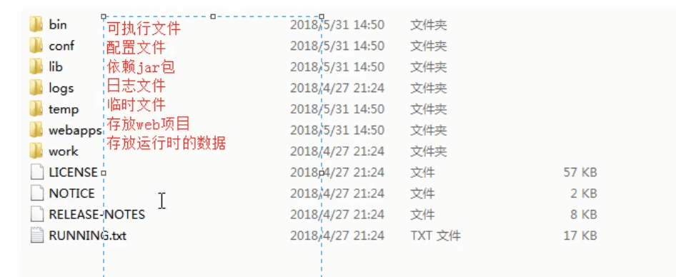
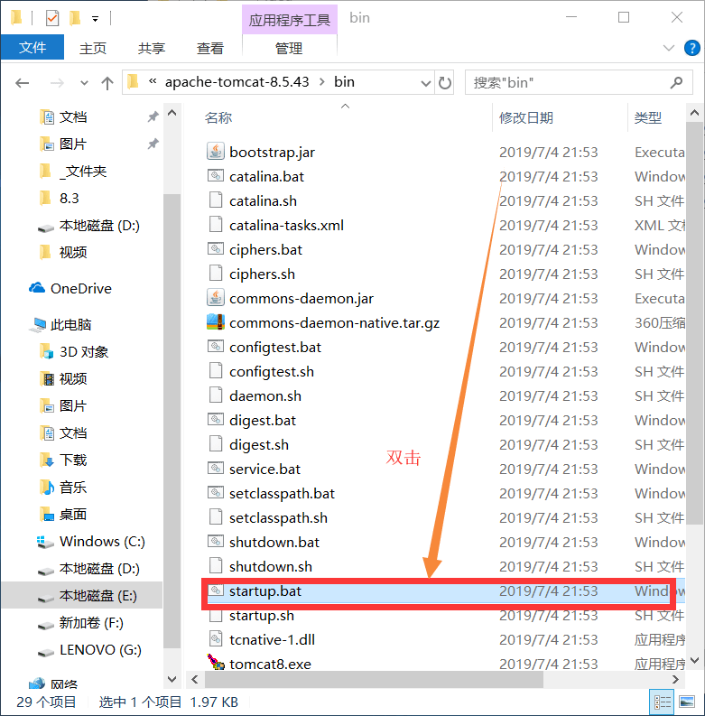
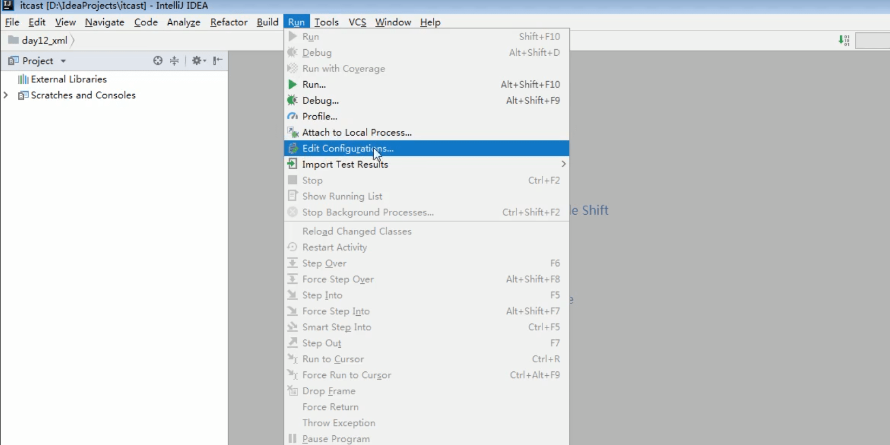
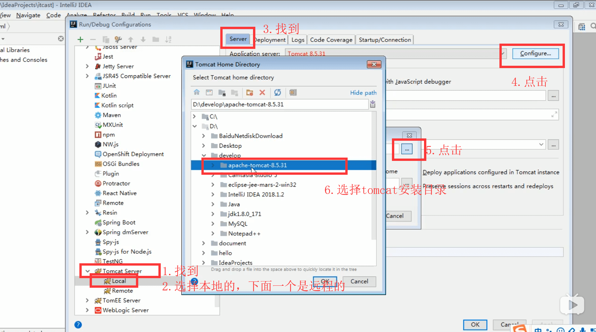
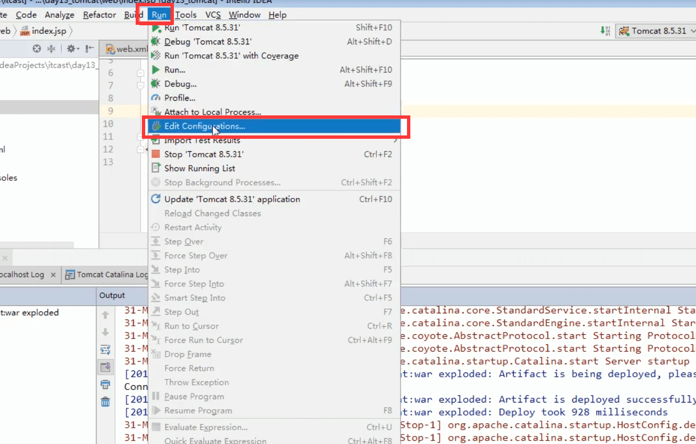
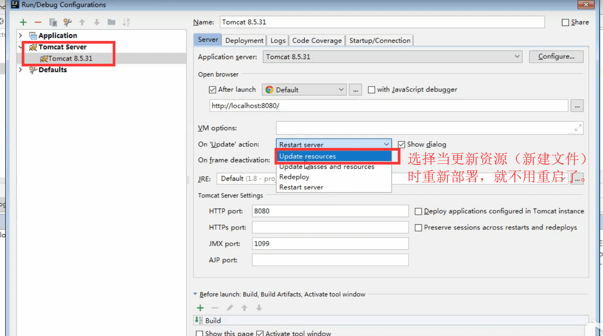
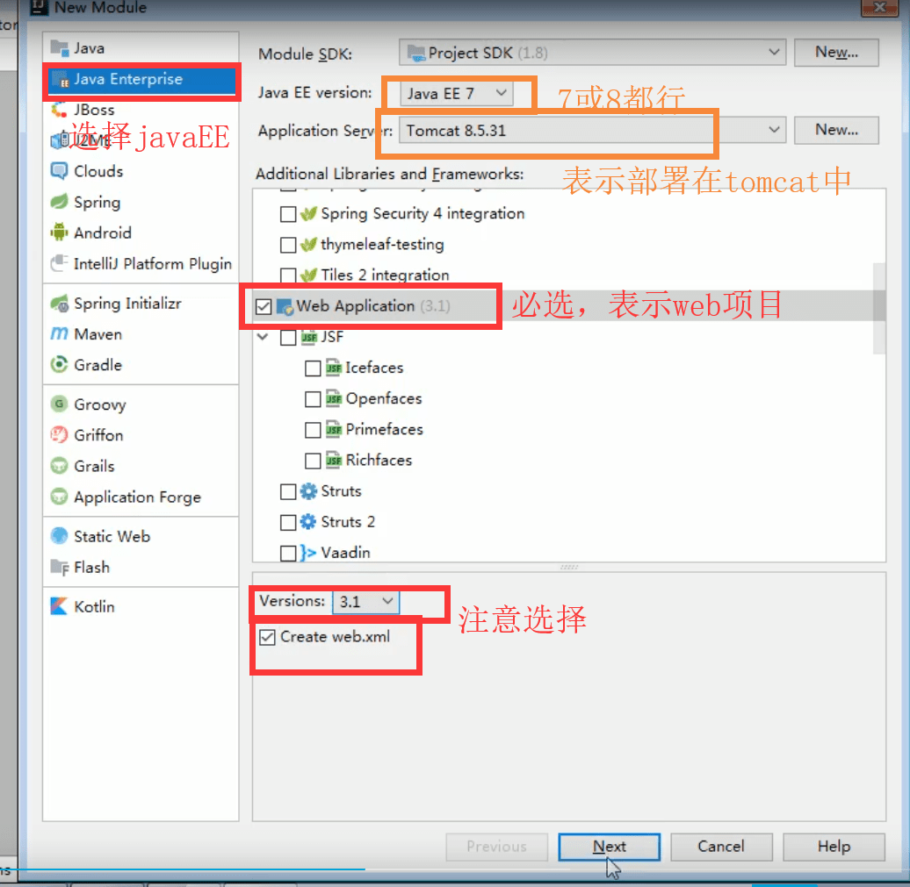
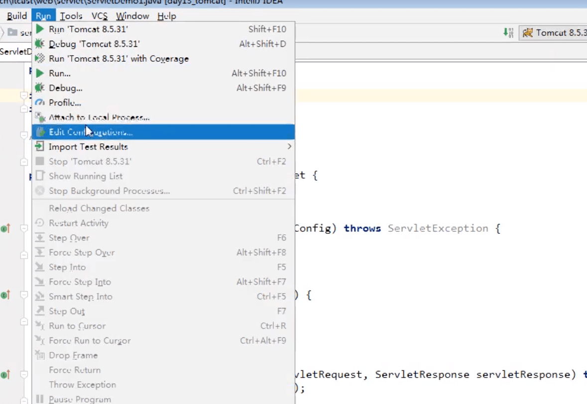
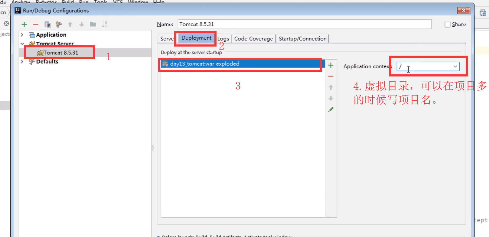

## 01在eclipse中新建jsp文件

1. 新建 --→ 项目 --→ Web --→ Dynamic Web Project --→下一个界面

2. 项目命名 --→ 修改Dynamic web module version为2.5 --→  完成 --→ 下一界面

3. 找到WebContent文件夹下新建jsp文件 --→ 把文件里ISO-8859-1修改为UTF-8（也可使用修改设置永久修改）

>  永久修改方法：窗口 → 首选项 → 搜索web → 找到JSP Files → 修改Encoding 为 ISO 10646/Unicode（UTF-8）；

## 02什么是JSP

从用户角度来看，就是一个网页，从程序员角度来看，就是一个java类，它继承了servlet，所以可以说jsp就是一个servlet。

JSP是干什么的？

hrml多数情况下永凯显示静态网页内容，一成不变。但是有时候需要显示静态数据，比如查询所有学生信息，根据姓名查询具体某个学生。这些动作需要查询数据库，然后在网页上显示，HTML里不支持Java代码，jsp里可以写java代码。

## 03JSP三大指令

指令写法：`<%@指令%>`

### page指令

1. language：表明jsp里面写的代码语言，如java、php。

2. contenctType：说明此文件是什么类型，告诉浏览器我是什么内容类型，以及使用什么编码。

3. pageEncoding：用来说明JSP内容编码。

   ```jsp
   <%@ page language="java" contentType="text/html; charset=UTF-8"
       pageEncoding="UTF-8"%>
   ```

---

---

## 01web服务器软件
1. 服务器：安装了服务器软件的计算机
2. 服务器软件：接受用户请求，处理请求，做出响应。
3. web服务器软件：接受用户的请求，处理请求，做出响应。
4. 在web服务器软件中，可以部署web项目，让用户通过浏览器来访问这些项目。
5. web容器
6. 常见的Java相关的web服务器软件：
   1. webLogic：oracle公司，大型的JavaEE服务器，支持所有的JavaEE规范，收费。
   2. WebSphere：IBM公司，大型的JavaEE服务器，支持所有的JavaEE规范，收费。
   3. JBOSS：JBOSS公司，大型的JavaEE服务器，支持所有的JavaEE规范，收费。
   4. TomCat：Apache基金组织，中小型的JavaEE服务器，仅仅支持少量的JavaEE规范servlet/jsp，免费。

7. JavaEE：Java语言在企业级开发中使用的技术规范和总和，一共规定了13项大的规范。

8. TomCat：web服务器软件
   1. 下载：http://tomcat.apache.org/

   2. 安装：解压即安装。

9. 卸载：删除目录即可。

10. 启动：

   1. bin/startup.bat，双击运行该文件即可!

   2. 访问：浏览器输入：http://localhost:8080 访问自己

      ​									http://ip:8080 访问别人

11. 可能遇到的问题：

    1. 黑窗口一闪而过：
       1. 原因：没有正确配置|JAVA_HOME环境变量。
       2. 解决：正确配置即可。
    2. 启动报错：
       1. 暴力：找到占用的端口号，并且找到对应的进程，杀死该进程 `netstat  -ano`CMD查看端口号命令，查找占用8080端口号的进程。
       2. 温柔：修改自身的端口号（不建议使用）
          1. conf/server.xml
          2.` <Connector port="8888" protocol="HTTP/1.1" connectionTimeout="20000" redirectPort="8445"/>`
          3. 一般会将TomCat的默认端口号修改为80.这样访问时就可以省掉端口号了。

12. 关闭：

    1. 正常关闭：
       1. bin/shutdown.bat
       2. Ctrl+C
    2. 强制关闭：
       1. 点击启动窗口的x

13. 配置（部署项目）：

    1. 直接将项目放到webapps目录下即可。
       1. /hello：项目的访问路径 --> 虚拟目录
       2. 简化部署：将项目打包成一个war包，再将war包放置到webapps目录下。war包会自动解压缩。
    2. 配置conf/server.xml文件
       1. 在`<Host>`标签中配置
       2. `<Context docBase="D:/hello" path="/hehe"/>`
       3. docBase：项目存放的路径
       4. path：虚拟目录
    3. 在conf/Catalina/localhost创建任意名称的xml文件。在文件中编写`<Context docBase="D:/hello"/>`
       * 虚拟目录：xml文件的名称

14. 静态项目和动态项目：

* 目录结构（java动态）

  ```jsp
  项目根目录
  	web-inf目录
  		web.xml:web项目的核心配置文件
  		classes：放置字节码文件的目录
  		lib目录：放置依赖的jar包
  ```

* 将tomcat集成到IDEA中，并且创建JavaEE的项目，部署项目。

15. 执行原理：

    1. 当服务器接收到客户端浏览器的请求后，会解析请求URL路径，访问获取的servlet资源路径。
    2. 查找web.xml文件，是否有对应的`<url-pattern>`标签提内容。
    3. 如果有，则再找到对应的`<servlet-class>`全类名
    4. tomcat会将字节码文件加载进内存，并且创建其对象。
    5. 调用其方法。

16. idea的使用：

    1. 配置tomcat

       

       

    2. 设置更新资源重新部署

    3. 

       

    4. 新建web工程

       

       

    5. 虚拟符号的设置

       

    

