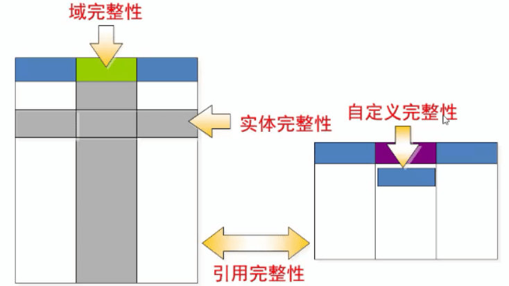

# 数据完整性




域完整性和实体完整性在之前的内容中都已经涵盖了，自定义完整性为了解内容。下面重点说明一下引用完整性，外键。

## 引用完整性

如果有两个表，都有主键，且两者的主键是公共字段，从表的主键是主表的外键。**只有innodb引擎能创建外键，myisam等引擎不支持外键**

1. 外键约束的特点
   1. 主表中没有的，从表中不允许插入。
   2. 从表中有的，主表不允许删除。
   3. 不能改主表中的值，而导致从表孤立存在。
   4. 先删从表，才能删主表。
2. 外键（foreign key）
   1. **外键是从表中的公共字段，公共字段名字可以不一样，但是数据类型必须一样。**
   2. 外键约束用来保证引用完整性。
3. **外键的创建，添加和删除**
   1. 建表时添加外键：使用语句 `foreign key (从表要添加外键的字段名) references 主表名(主表字段名)`。
   2. 修改表时添加外键： `altre table 从表表名 add foreign key (从表字段名) references 主表名 (主表字段名);`
   3. 通过外键名(使用查询创建表的语句查看外键名)删除外键：`alter table 从表表名 drop foreign key 外键名;`。

```mysql
/*
	创建外键
*/
# 创建主表,学生信息(student inforence)表
create table stuinf(
	id int,
	stuid char(11) not null primary key, # 必须是主键
	name varchar(10)
);
# 创建从表，学生分数(student score)表
create table stusco(
	stuid char(11) not null,
	score decimal(4,1),
	foreign key (stuid) references stuinf(stuid) #添加外键，通过两个表的stuid建立联系
);
/*
	添加外键
*/
# 创建主表,学生信息(student inforence)表
create table stuinf(
	id int,
	stuid char(11) not null primary key,
	name varchar(10)
);
# 创建从表，学生分数(student score)表
create table stusco(
	stuid char(11) not null,
	score decimal(4,1),
);
# 添加外键
alter table stusco add foreign key(stuid) reference stuinf(stuid);
/*
	删除外键
*/
alter table stusco drop foreign key 外键名;
```

## 外键操作(了解)

1. 严格操作，以上讲的都是严格操作。
2. 置空操作(set null)；如果主表记录删除或更新，从表置空。
3. 级联操作(cascade)；如果主表记录删除或更新，从表级联。

一般来说，主表某数据删除时，从表对应数据置空；主表数据更新时，从表对应数据级联。

```mysql
# 语法
foreign key (外键) references 主表(关键字段) [主表删除时的动作] [主表数据更新时的动作];
```

例子：

```mysql
# 创建主表
create table stuinf(
	stuno char(4) primary key,
	name varchar(10) not null
);
# 从表
create table stusco(
	stuid char(4),  # 不能做主键，否则无法置空
	score tinyint unsigned,
	foreign key (stuid) references stuinf(stuno) on delete ste null on update cascade
);
```

这样，如果你改动了主表中的某些数据，从表也会发生相应的改变。

## 保证实体完整性

1. 主键约束
2. 唯一约束
3. 自动增长

## 保证域完整性

1. 数据类型约束
2. 非空类型约束
3. 默认值约束

## 保证引用完整性

- 外键约束，从表中的公共字段是主表中的外键。

## 保证自定义完整性

1. 存储过程
2. 触发器